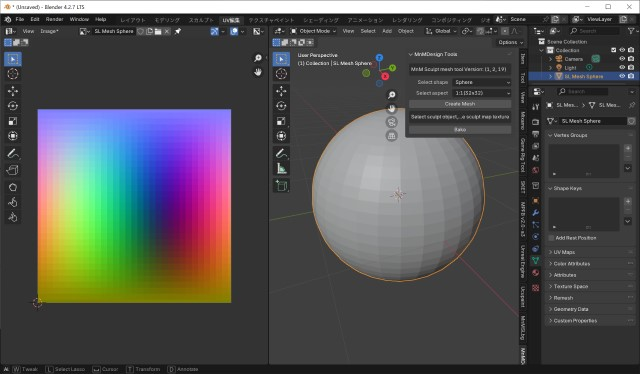

# mnmSLSculptMeshTool
Add a mesh of SL-Sculpt, and Generate UV and Sculpt texture. for Blender 4.0 or later ( 4.2, 4.3 )

## Getting started
Download zip file (file name is mnmSLSculptMeshTool-main.zip, maybe).  
**ATTENTION DONT UNZIP DOWNLOAD FILE**.  
Install add-ons in preferences menu. click install button and select downloaded a zip file.

Click checkbox to enabled this plugin.

The 'MnMDesign' tab appears in 3DView Toolshelf (click N key).

## Create a sculpt mesh

Simply, click to 'Create Mesh' button in MnMDesign Tools panel.

You can select two options:  
* Shape (Cylinder, Sphere, Plane)
* Aspect
  * 1:1 (w32 x h32)
  * 1:4 (w16 x h64)
  * 1:16 (w8 x h128)
  * 1:32 (w4 x h256)
  * 4:1 (w64 x h16)
  * 16:1 (w128 x h8)
  * 32:1 (w256 x h4)

A mesh object with UV map and sculpt map image will be created.

## Bake a sculpt map image

After finishing editing the vertices of the sculpt object, you need to bake a sculpt map image.

* Selected target sculpt mesh object (in OBJECT-MODE, not a EDIT-MODE).
* Click 'Bake' Button.
* Confirem a bake image in Image Editor View or UV Editor view.
* The name of a baked image will be the same as the object name.

## Bake with mask image

You can apply a mask to the image during baking (to prevent copying)

* You need to prepare a mask image with the same resolution as the sculpt map image.
* The mask image must be in a format that has an alpha channel (.png or .tga)
* Add new texture in the Texture block.
* Change the texture name to 'mask'.
* Load the prepared mask image in the Image Settings.
* Click 'Bake' button, and Confirem baked image.

